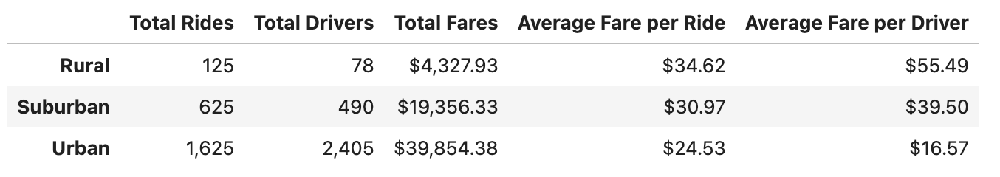
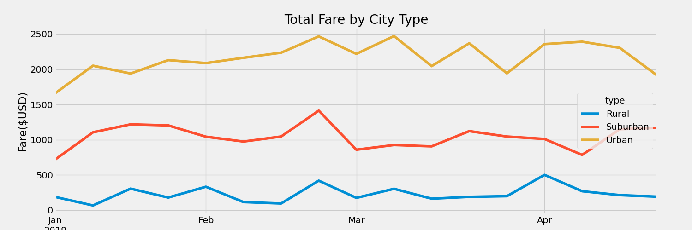

## Overview
This is an analysis of ride-sharing data for a Python-based ridesharing app company called PyBer. This analysis utilizes Python libraries for data analysis and visualization, Pandas and Matplotlib. The purpose of this analysis is to understand the service differences between rural, urban and suburban cities. 
## Results
The data was first grouped by city type, then total rides, drivers, and fares were totaled, and average fare per ride and driver was calculated. See image below for these figures.

Service is busiest in urban cities, with the greatest total fares and rides. But rural and suburban cities generate more fare revenue on average. Based on the graph below, demands for service peak in similar ways across all city types.

## Summary
Based on these results, there are service disparities among the city types. By incentivizing more drivers in rural and suburban cities total fare revenue can be increased.
